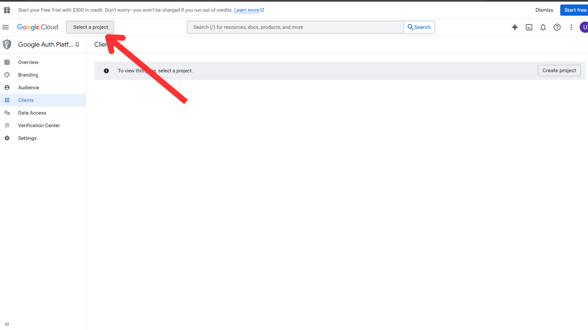
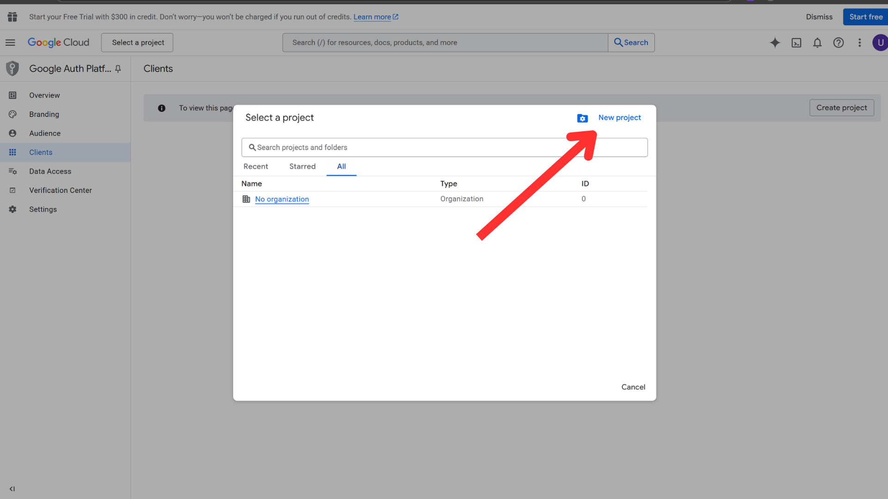
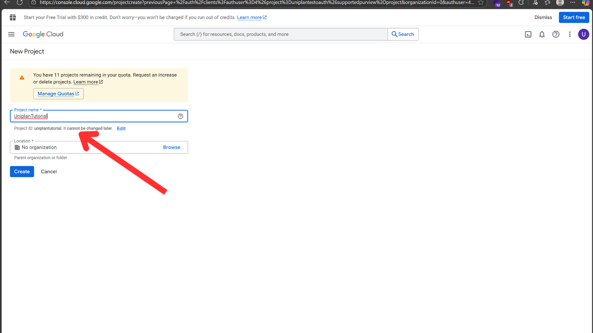
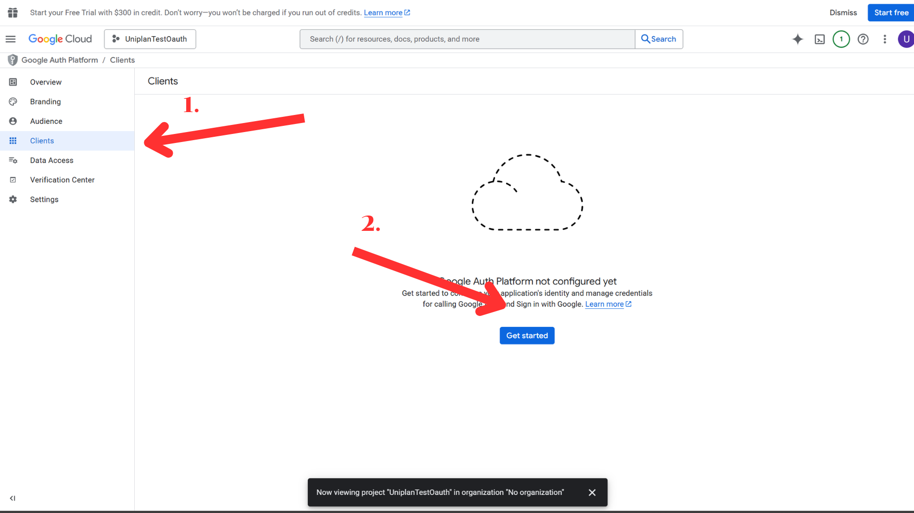
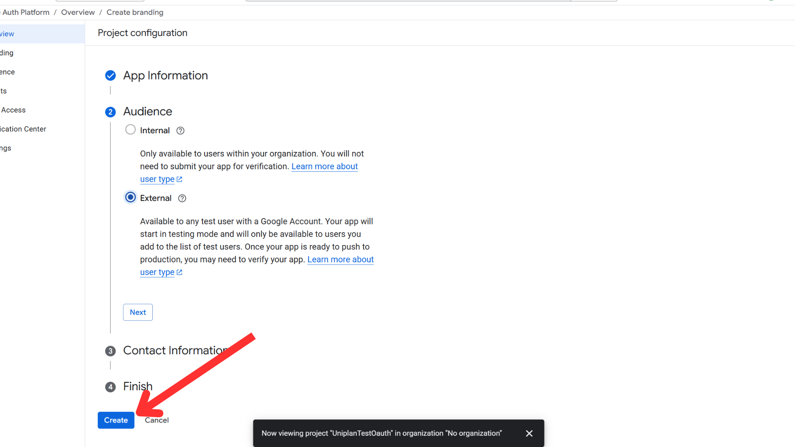
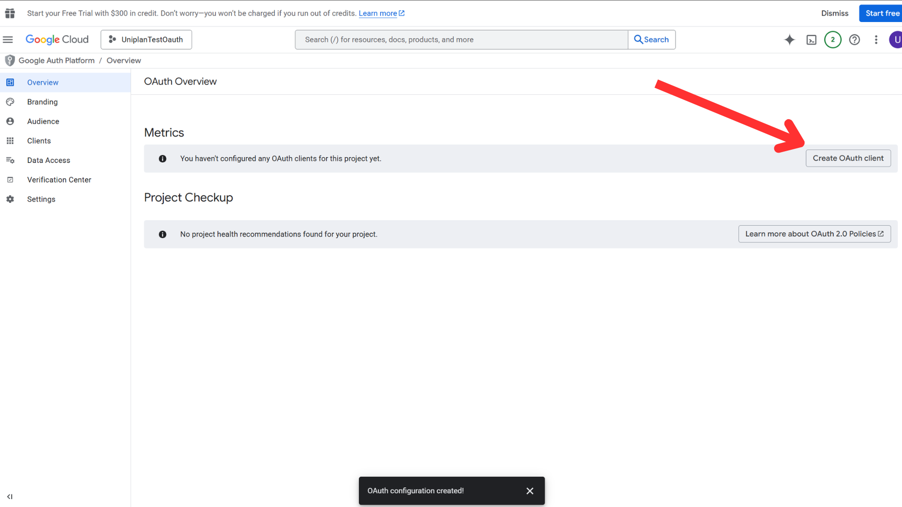

# OAuth2 Setup Guide

Follow these steps to configure **Google OAuth2** for this project set up credit(uniplan group project from isp) setup.

---

## **1. Create a Google Cloud Project**

- Go to the Google Cloud Console.  
- Click the project dropdown → **New Project**  
- Enter a project name → Click **Create**

  
  


---

## **2. Client & Project Configuration**

- After creating the project, click **Client** in the side menu and select **Get Started** to set up the OAuth consent screen.  


- Fill in the required details, select **External**, then click **Create**.  


---

## **3. OAuth Consent Screen Configuration**

- Go to **Overview** → Click **Create OAuth Client**  


- Choose **Web Application** as the application type and enter your project name.

### **Authorized JavaScript Origins**

- Add the following URL:  

```
http://localhost:5173
http://127.0.0.1:5173
```


### **Authorized Redirect URIs**

- Add the following URL:  

```
http://127.0.0.1:8000/auth/google/callback/
http://localhost:8000/auth/google/callback/
```


### Then you can click create it and copy the CLIENT_ID, CLIENT_SECRET in .env


